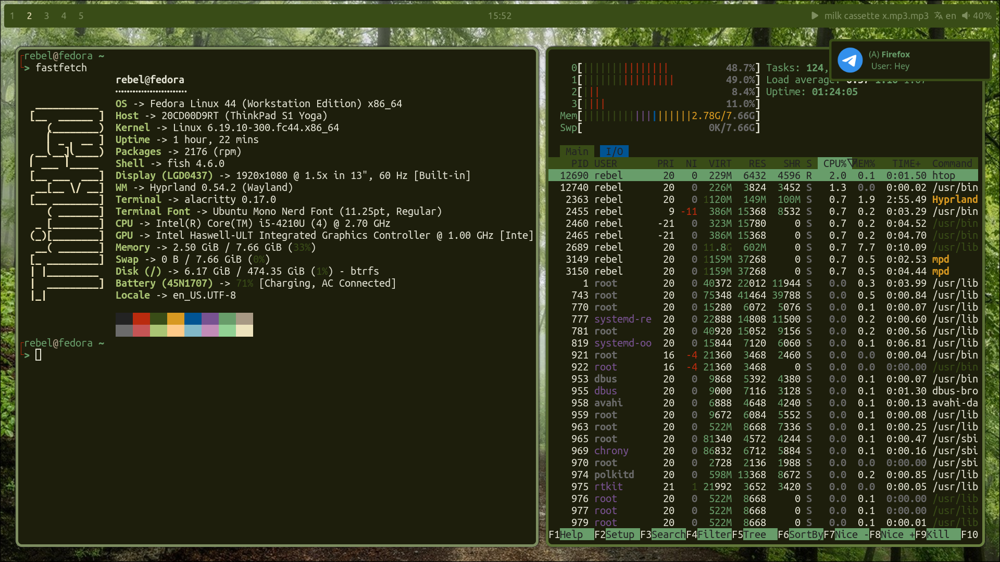
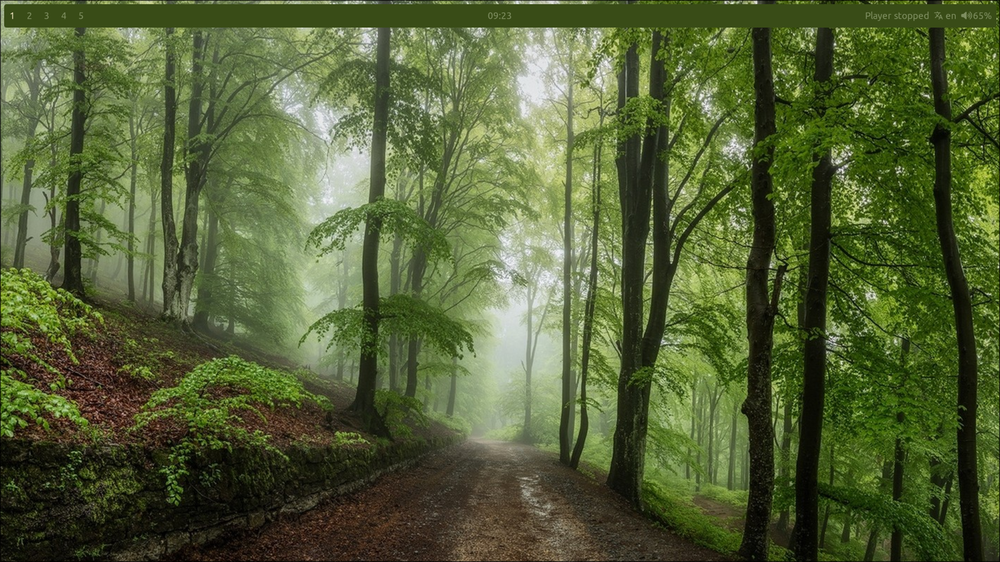
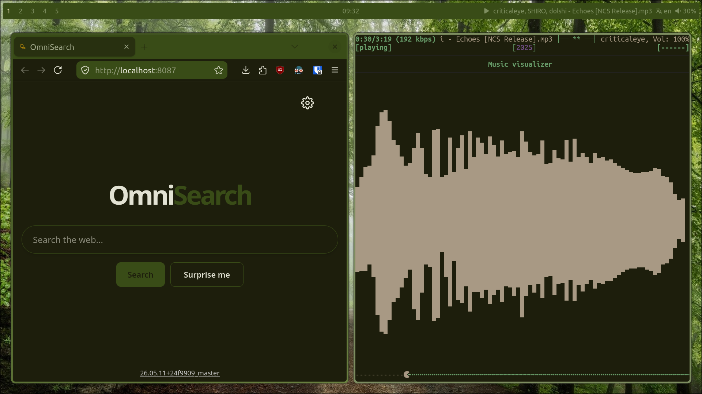

# "Into-the-Woods"| Fedora + Hyprland

## Appearance

## Description
A try to make a minimal hyprland rice with a self-made colorsheme "Into the Woods".

## Tools
- Terminal: Alacritty
- Notification Manager: Dunst
- Fetch: Fastfetch
- Shell: Fish (omf theme: yimmy)
- Application Launcher: Fuzzel
- WM: Hyprland
- Music Player: mpd + ncmpcpp & mpc
- Browser: Firefox
- Metasearch Engine: Omnisearch
- Bar: Waybar
- Text Editor: default Vim
- File Manager: Nautilus

## About
This rice was made for a rice contest of a russian, linux Discord server. 
